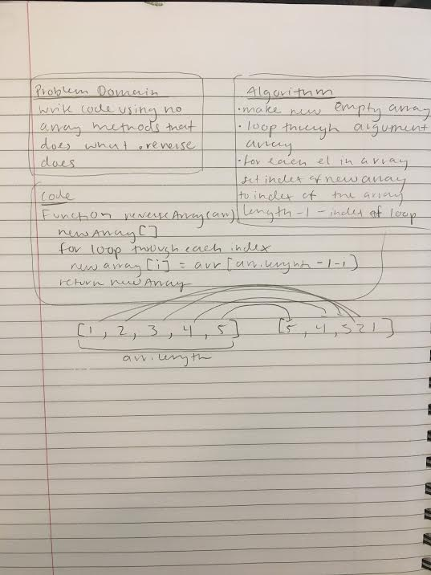

# data-structures-and-algorithms

##Code Challenges 
1) arrayReverse 
### TASK: Write a function called reverseArray which takes an array as an argument. Without utilizing any of the built-in methods available to your language, return an array with elements in reversed order.

2) insertShiftArray
### TASK: Write a function called insertShiftArray which takes in an array and the value to be added. Without utilizing any of the built-in methods available to your language, return an array with the new value added at the middle index.